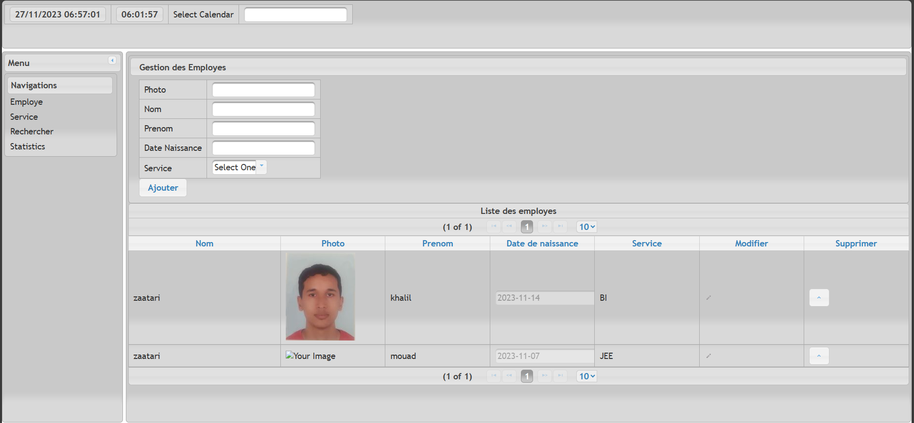

# Projet de Gestion des Employés et des Services

## Description

Ce projet utilise JavaServer Faces (JSF) pour créer une application de gestion des employés et des services. L'objectif principal est de fournir une interface conviviale permettant d'ajouter, de modifier et d'afficher les informations liées aux employés et aux services.

## Fonctionnalités

### Ajouter un Employé

Permet d'ajouter un nouvel employé à la base de données. L'utilisateur devra fournir des informations telles que le nom, le prénom, le service, etc.

### Ajouter un Service

Permet d'ajouter un nouveau service à la liste des services disponibles. L'utilisateur devra spécifier le nom du service et éventuellement d'autres détails pertinents.

### Modifier un Employé

Permet de mettre à jour les informations d'un employé existant. L'utilisateur pourra modifier des champs tels que le poste, le numéro de téléphone, etc.

### Modifier un Service

Permet de mettre à jour les détails d'un service existant. L'utilisateur peut modifier des informations telles que la description, la localisation, etc.

### Afficher les Employés par Service

Affiche la liste des employés triés par service. Cette fonctionnalité offre une vue organisée des employés en fonction de leur service d'affectation.

## Prérequis

- Java Development Kit (JDK)
- Apache Tomcat (ou tout autre conteneur compatible JSF)
- Base de données compatible avec Java Persistence API (JPA)

## Configuration

1. Clonez le dépôt sur votre machine locale.
2. Importez le projet dans votre environnement de développement.
3. Configurez la base de données dans le fichier de configuration.

## Installation

1. Compilez le projet à l'aide de votre environnement de développement.
2. Déployez le fichier WAR généré sur votre serveur Tomcat.

## Utilisation

1. Lancez l'application via le navigateur en accédant à l'URL appropriée.
2. Utilisez les fonctionnalités disponibles pour gérer les employés et les services.

## Contributeurs

- Khalil ZAATARI

## Licence

Ce projet est sous licence [MIT License](LICENSE).

